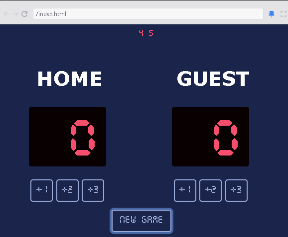

# Basketball Scoreboard

This project is a basketball scoreboard application I created during my study for the [frontend developer path course on Scrimba.com](https://scrimba.com/frontend-path-c0j) designed to track and display scores for basketball games. It provides an easy-to-use interface for managing team scores, game time, and other relevant statistics.



## Technologies Used
- HTML
- CSS
- JavaScript

## How to Run
1. Clone the repository.
2. Navigate to the project directory.
3. Run the following commands:
   ```bash
   npm install
   npm start